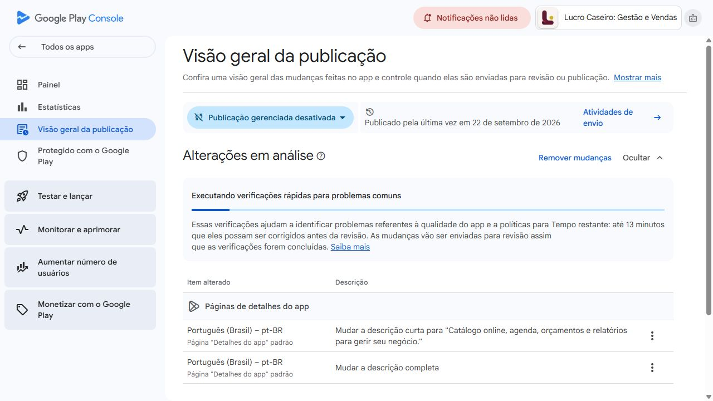

# Configuração da Google Play e próximos passos

Data: 28/09/2026. App: `br.com.orionseven.lucrocaseiro`.

**Execução interna autorizada posteriormente:** a simplificação do primeiro acesso, o cadastro canônico, a atribuição Android e o painel de aquisição foram implementados. Publicações, testes, indicadores iniciais e pendências da versão Android estão no [registro da implementação](implementacao-app.md).

**Quatro pontos de alcance:** galeria, versão Android, páginas por público e experimento têm documentação e acompanhamento próprios no [plano específico de alcance](plano-alcance-google-play.md).

## Conferência complementar de alcance — 28/09/2026

- A ficha agora aparece como **No ar**, com os novos textos dos diferenciais. A visão geral da publicação informa publicação em 28/09/2026 e não exibe mais o bloco de alterações em análise.
- As quatro imagens atuais foram conferidas nos detalhes dos arquivos: `02-precificacao-1080x1920.png`, `03-catalogo-1080x1920.png`, `04-financeiro-1080x1920.png` e `01-seu-negocio-1080x1920.png`, todas com **1080 × 1920 px**. A ordem da galeria começa pela precificação.
- Já existe vídeo cadastrado: `https://youtu.be/2Zo-BacemKc`. Seu conteúdo não foi reavaliado nesta conferência.
- A página inicial da conta confirmou que todos os apps do Google Play já foram registrados para a verificação de desenvolvedor Android.
- Há somente a ficha padrão; páginas personalizadas ainda não foram criadas. A coluna de experimentos oferece **Configurar**.
- Próximas prioridades: atualizar a sequência visual para mostrar catálogo personalizado, orçamento convertido em encomenda, agenda e relatórios; revisar o vídeo; validar a versão 31 em aparelho e promover para produção; preparar páginas por público quando houver divulgação específica. Experimentos A/B ficam para quando o volume permitir uma comparação útil.

As próximas seções preservam o registro da primeira configuração, quando a análise dos textos ainda estava pendente.

## O que foi feito

| Item                         | Resultado verificado na Console                                                                                                                                                                              |
| ---------------------------- | ------------------------------------------------------------------------------------------------------------------------------------------------------------------------------------------------------------ |
| Tag                          | Empresa adicionada; categoria já era Empresa                                                                                                                                                                 |
| Site público da ficha        | Alterado de `https://www.orionseven.com.br/` para `https://lucrocaseiro.com.br/`; confirmação “Alteração publicada”                                                                                          |
| Descrição curta              | “Catálogo online, agenda, orçamentos e relatórios para gerir seu negócio.” — 72/80 caracteres                                                                                                                |
| Descrição completa           | Reescrita para destacar catálogo personalizado, orçamentos convertidos em encomendas, agenda, relatórios, exportações, etiquetas, kits e custos da operação, com distinção dos planos — 2786/4000 caracteres |
| Envio                        | Análise reiniciada com as duas descrições ampliadas; confirmação “Alterações em análise”, com o novo texto visível no painel                                                                                 |
| Publicação                   | Publicação gerenciada desativada; as descrições dependem da aprovação do Google                                                                                                                              |
| Distribuição                 | Brasil segmentado, produção ativa; versão 30 (1.2.1) com lançamento de 100%                                                                                                                                  |
| Divulgação externa do Google | Já habilitada                                                                                                                                                                                                |

A Console informou que revisões geralmente levam até sete dias, podendo levar mais. O envio foi concluído; a aprovação ainda estava pendente na verificação. Nome, ícone, imagens e vídeo existentes foram preservados. Esta primeira etapa alterou a ficha; a versão 1.2.2 (31) é tratada no registro de implementação interna acima.

As tags ajudam o Google a classificar o app e seus contextos de exibição; adicionar tags não garante destaque. Foi usada a tag Empresa, sugerida pela própria Console e coerente com a função principal. [Orientação oficial de categoria e tags](https://support.google.com/googleplay/android-developer/answer/9859673?hl=pt-BR).

## Base para decidir

No período comparável de 1 a 25 de agosto e setembro, as aquisições de dispositivos passaram de 26 para 6; as de navegação no Google Play passaram de 19 para 3. Essa origem responde por 16 das 20 aquisições perdidas. A redução da descoberta foi observada; o mecanismo que levou o Google a reduzir as exibições não foi identificado.

Das 17 contas novas não administrativas de agosto, 10 têm produto e 6 têm venda cadastrada no retrato atual; 3 tiveram atividade registrada em setembro. Esses números não constituem retenção D30 nem provam desinstalação, mas orientam a investigação da primeira experiência.

Fonte detalhada, períodos, exclusões e limitações: [análise de aquisição](README.md).

## Plano de execução

### 1. Medir a primeira experiência antes de ampliar o investimento

- Corrigir a emissão de `signup_completed` no cadastro pelo Google e impedir duplicidade por usuário. Atualmente o evento é incompleto.
- Conferir em aparelho real: instalação nova → entrada pelo Google → conclusão do cadastro → primeiro produto ou primeira venda → retorno ao app. As contas recentes confirmadas no provedor não bastam para comprovar o fluxo completo no aplicativo.
- Medir primeiro produto, primeira precificação concluída e primeira venda, com denominadores de usuários novos e tempo até a primeira ação útil.
- Instrumentar atribuição de instalação quando disponível. Hoje os campos `utm_source` e `referrer` das instalações estão vazios; um link de campanha por si só não cria essa ligação no banco.

### 2. Melhorar a apresentação visual da loja

- Priorizar nas três primeiras imagens: resultado da precificação, registro de venda e visão do dinheiro do negócio.
- Usar capturas reais da versão atual, com texto curto e legível e sem prometer faturamento ou lucro garantido.
- Conferir os arquivos originais: para formatos de recomendação que usam capturas, o Google pede pelo menos quatro imagens em alta resolução, em 9:16 ou 16:9. A dimensão de uma miniatura na Console não demonstra a resolução do original. [Especificações de recursos visuais](https://support.google.com/googleplay/android-developer/answer/9866151?hl=pt-BR).

### 3. Distribuir com demonstrações e links por canal

Preparar três demonstrações curtas nesta primeira semana, cada uma com um exemplo completo:

1. “Você sabe quanto custa o produto que vende?” — mostrar custos e preço.
2. “Como encontrar as vendas que ainda não foram pagas” — mostrar registro e pendências.
3. “Quanto entrou e quanto saiu nesta semana?” — mostrar entradas e despesas.

Publicar nos canais do negócio e adaptar exemplos para alimentos, artesanato ou serviços. Em parcerias, escolher públicos que já vendem produtos ou atendem clientes e usar um identificador por parceiro. O roteiro deve mostrar a ação real no app e terminar com o link da loja.

Links preparados para uso; nenhuma mensagem a parceiros ou campanha paga foi disparada:

- [Instagram — bio e publicações](https://play.google.com/store/apps/details?id=br.com.orionseven.lucrocaseiro&utm_source=instagram&utm_medium=organic_social&utm_campaign=retomada_202609&referrer=utm_source%3Dinstagram%26utm_medium%3Dorganic_social%26utm_campaign%3Dretomada_202609)
- [WhatsApp — divulgação autorizada](https://play.google.com/store/apps/details?id=br.com.orionseven.lucrocaseiro&utm_source=whatsapp&utm_medium=organic_social&utm_campaign=retomada_202609&referrer=utm_source%3Dwhatsapp%26utm_medium%3Dorganic_social%26utm_campaign%3Dretomada_202609)
- [Parcerias — modelo de campanha](https://play.google.com/store/apps/details?id=br.com.orionseven.lucrocaseiro&utm_source=parcerias&utm_medium=referral&utm_campaign=retomada_202609&referrer=utm_source%3Dparcerias%26utm_medium%3Dreferral%26utm_campaign%3Dretomada_202609)

Na Console, consultar **Desempenho na loja → Análise de conversão**, filtrando anúncios e indicações e detalhando origem/campanha UTM. Atribuições com pouco volume podem ser agregadas. Visitantes e cliques em instalar devem ser acompanhados separadamente das aquisições efetivas. [Definições e dimensões oficiais](https://support.google.com/googleplay/android-developer/answer/9859173?hl=pt-BR).

### 4. Reduzir desistência dentro do aplicativo

- Dar um caminho inicial conforme o objetivo: calcular preço ou registrar venda. Levar diretamente à ação escolhida e permitir completar os demais cadastros aos poucos.
- Mostrar limites e benefícios dos planos no momento relevante, antes da decisão de assinatura, preservando o trabalho já preenchido.
- Explicar erros de login e recuperação com uma ação possível; verificar especialmente o retorno do login Google ao app.
- Medir retorno D1 e D7 por turma de entrada, usando somente usuários que já tiveram tempo de completar cada janela.
- Pedir feedback de pessoas que não concluíram a primeira ação, quando houver autorização para contato. A pergunta central é onde pararam e o que esperavam conseguir.

Esses passos são hipóteses de melhoria a validar. Configurar a loja melhora a apresentação, mas o acompanhamento da primeira sessão é necessário para identificar e reduzir abandono.

### 5. Tratar o aviso técnico na próxima versão

O painel da versão 30 (1.2.1) exibiu **ofuscação DEX em 1%**, abaixo do limite de 25%, com prazo até **fevereiro de 2027**. O aviso diz que valores abaixo do limite podem afetar visibilidade e recursos de publicação. Investigar configuração R8 e regras de preservação, gerar um pacote otimizado e testar os fluxos críticos antes do lançamento. [Documentação oficial de otimização DEX](https://developer.android.com/topic/performance/issues/code-optimization).

Também aparecem recomendações sobre APIs de exibição de ponta a ponta e restrições de orientação/redimensionamento em telas grandes. As taxas de falhas e ANRs da versão estavam sem dados suficientes; isso não comprova ausência de falhas. O aviso DEX não foi demonstrado como causa da queda de setembro.

## Como avaliar o resultado

Registrar a data efetiva da aprovação da ficha. Comparar 14 dias completos antes e depois, mantendo o mesmo país e os mesmos canais, e confirmar a tendência com 28 dias. Anotar publicações, parcerias e versões lançadas no período.

| Etapa              | Medida principal                                                   |
| ------------------ | ------------------------------------------------------------------ |
| Descoberta         | Impressões e visitantes por origem                                 |
| Interesse          | Cliques em instalar e CTR oficial da ficha                         |
| Instalação         | Aquisições de usuários/dispositivos, sem misturar as duas unidades |
| Cadastro           | Novas contas válidas, separando administradores/testes conhecidos  |
| Primeira utilidade | Usuários que concluem o primeiro produto, cálculo ou venda         |
| Retorno            | D1/D7 de turmas com janela completa                                |

Com o volume atual, sempre mostrar contagens junto das porcentagens. Poucas instalações não sustentam conclusões fortes sobre pequenas variações ou testes com muitas versões da ficha. Um antes/depois também pode refletir divulgação e sazonalidade, não apenas a mudança de texto.

## Registro

- [Ficha atualizada no repositório](../play-store/listing.md)
- [Texto enviado com os diferenciais](play-listing-diferenciais.json)
- [Histórico da primeira alteração](play-listing-alteracoes.json)
- [Distribuição brasileira](play-distribuicao-brasil.png)
- [Tag e site aplicados](play-configuracoes-aplicadas.png)
- [Console — envio](https://play.google.com/console/u/2/developers/9157320642643495130/app/4974447739544171365/publishing)
