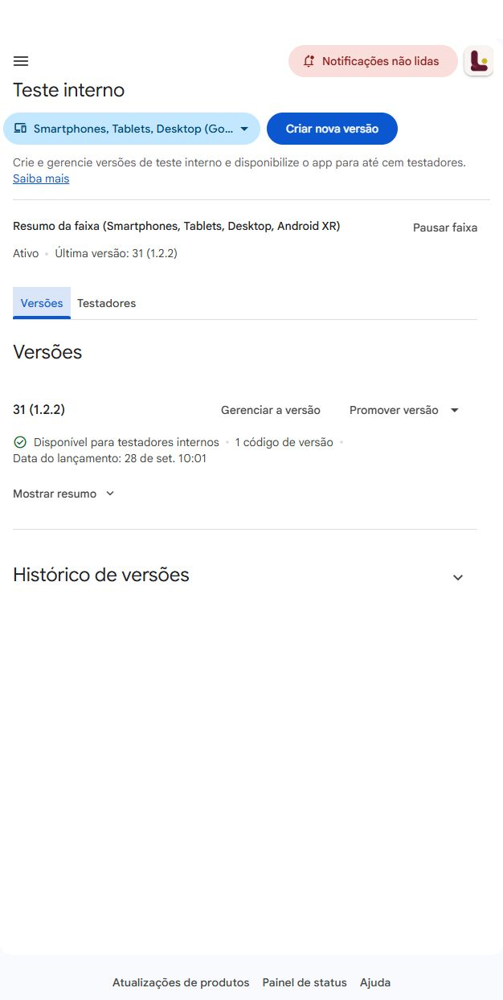
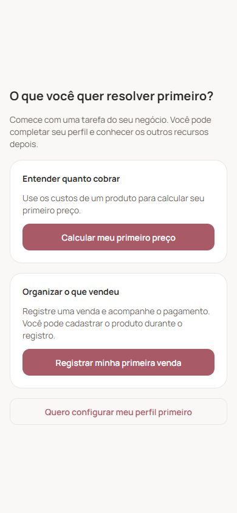

# Implementação interna — aquisição e primeira experiência

Data: 28/09/2026. Lucro Caseiro, versão Android preparada: **1.2.2 (31)**.

**Conferência posterior na Play Console:** a versão 31 apresentou **95% de ofuscação DEX**, classificação **Alta**, e foi preparada como rascunho de produção (release 12). A liberação pública continua pendente de teste Android. Evidências e estado atual no [plano específico de alcance](plano-alcance-google-play.md).

## Entrega

| Área                      | Mudança                                                                                                                                                                         |
| ------------------------- | ------------------------------------------------------------------------------------------------------------------------------------------------------------------------------- |
| Primeiro acesso           | Escolha entre calcular o primeiro preço e registrar a primeira venda. O questionário do perfil fica opcional e continua acessível depois.                                       |
| Falhas no primeiro acesso | A escolha só navega após salvar a decisão na conta. Falhas mantêm as opções, explicam o problema e permitem nova tentativa.                                                     |
| Cadastro Google/e-mail    | `signup_completed` é registrado pelo backend na identificação autenticada, uma vez por conta, usando a data real do cadastro. Emissões desse evento pelo cliente são ignoradas. |
| Atribuição Android        | Leitura do Install Referrer da Google Play, limitada a origem, meio, campanha e conteúdo. Não grava o referrer bruto. A leitura tem prazo e não bloqueia o uso do app.          |
| Painel administrativo     | Nova aba **Aquisição**, com primeiro produto, cálculo, venda, primeira ação útil, tempo mediano, retorno D1/D7 por semana de cadastro e origem das instalações.                 |
| Qualidade das medidas     | Contas confirmadas, exclusão dos administradores configurados e denominadores com janela completa. A pessoa pode começar pela venda sem passar pela precificação.               |
| Android                   | R8 e redução de recursos ativados na compilação de produção. A medição DEX da Google Play deve ser conferida após processar o novo pacote.                                      |

Os limites e benefícios dos planos, o paywall contextual e os mecanismos existentes de preservação de formulários foram revisados e mantidos. A precificação mantém seu rascunho em memória por conta; isso não equivale a recuperação após encerrar o processo do app. O retorno do login Google em aparelho físico continua sendo uma verificação necessária da versão Android.

## Publicação

- **API em produção:** implantação `0f4a5bc1-6b7e-4c84-8f95-91e203808e5f`, resultado `SUCCESS`. Healthcheck respondeu `status: ok`; inicialização sem erro de migração.
- **PWA em produção:** implantação `2571400f-b148-4ab0-93b4-d754173e2435`, resultado `SUCCESS`. [Aplicativo publicado](https://app.lucrocaseiro.com.br/) respondeu HTTP 200 e carregou a sessão existente no navegador. Bundle publicado: `entry-d5edb5fcbb18554ae7fbd8e044b7ef0a.js`.
- **Android no teste interno:** compilação EAS `14127f23-2991-469b-9649-076d6d818834` concluída com sucesso às **12:57:31 UTC**. [Detalhes da compilação](https://expo.dev/accounts/marivscls/projects/lucro-caseiro/builds/14127f23-2991-469b-9649-076d6d818834). Pacote assinado salvo em `output/lucro-caseiro-1.2.2-31.aab` (103.080.944 bytes). A versão **31 (1.2.2)** foi publicada no teste interno às **10:01 de Brasília**, com confirmação “Disponível para testadores internos” e faixa **Ativo**. A faixa estava sem testadores; foi selecionada e salva a lista já existente **Mariana Vasconcelos (1 usuário)**. A outra lista permaneceu desmarcada. A submissão automática EAS não tinha chave de publicação configurada; foi usada a sessão existente da Console. O lançamento de produção continua na versão 30.
- **Ficha da Google Play:** texto com os diferenciais enviado para análise na etapa anterior. A aprovação da ficha e a distribuição do pacote Android são processos separados.

Foi usado um diretório de publicação isolado, com a versão rastreada no Git e os arquivos desta tarefa. O [manifesto dos arquivos alterados](arquivos-release-31.txt) identifica o conteúdo da entrega. Alterações de outras tarefas não foram incluídas. Os ajustes posteriores nos arquivos de contexto são documentação e não alteram o binário enviado.

## Verificações realizadas

- Suíte completa da API: **883 testes aprovados**.
- Suíte completa mobile: **865 testes aprovados**.
- Regressões específicas reexecutadas após os ajustes finais: cadastro único, atribuição, aquisição, migrações de inicialização e escolha inicial.
- Typecheck da API e do mobile: aprovado.
- Lint da API: sem erros, com avisos; lint dos arquivos mobile alterados: aprovado.
- Context lint e `git diff --check`: aprovados.
- Exportação web/PWA: concluída.
- Configuração nativa introspectada: versão 1.2.2, código 31, minificação e redução de recursos habilitadas.
- Pacote Android final inspecionado: inclui `BUNDLE-METADATA/com.android.tools.build.obfuscation/proguard.map` gerado pelo **R8 8.11.18**. A execução da otimização foi confirmada no artefato, além da configuração. [Hash e metadados da conferência](verificacao-android-31.json). O percentual DEX exibido pelo Google ainda precisa ser processado; não foi presumido a partir do mapa.
- A Play Console aceitou a versão 31 e reconheceu o mapa ReTrace e os símbolos nativos. Na revisão do teste interno, estimou **47 MB** para nova instalação, **14,3 MB a menos que a versão 17**, que era a anterior nessa faixa. Essa comparação não usa a versão 30 de produção. A Console não indicou perda de dispositivos compatíveis nessa comparação.
- Consulta agregada executada contra o banco real, somente leitura, com o mesmo driver usado pela aplicação.
- Os 30 arquivos de código/configuração do manifesto foram comparados por hash com o diretório enviado: nenhuma divergência.
- Conferência visual e interação em prévia local com os componentes reais: duas escolhas iniciais, mensagem de falha e painel de aquisição. Essa prévia não substitui um teste de instalação/login em aparelho Android.
- No PWA publicado, a conta já aberta no navegador não tem acesso administrativo: a rota do painel exibiu “Acesso restrito”, como esperado para essa conta. Nenhuma permissão foi ampliada. O relatório agregado salvo permite consultar a referência inicial enquanto uma conta já autorizada acessa o painel.

### Evidências visuais

- [Lista existente de testadores habilitada](play-testadores-31.png).

- [Mensagem após falha ao salvar a escolha](primeiro-acesso-erro-31.png).
- [Painel de aquisição com os dados agregados](painel-aquisicao-31.png).

## Referência antes da nova versão

Consulta em **28/09/2026 às 12:23:57 UTC**, janela de 90 dias. Há **38 contas confirmadas não administrativas**; **36** já completaram sete dias.

| Indicador                           | Contagem | Percentual | Tempo mediano entre quem concluiu |
| ----------------------------------- | -------- | ---------- | --------------------------------- |
| Primeira ação útil em até sete dias | 18/36    | 50%        | 3,8 min                           |
| Primeiro produto                    | 17/36    | 47,2%      | 3,8 min                           |
| Primeira precificação concluída     | 4/36     | 11,1%      | 29,3 min                          |
| Primeira venda                      | 10/36    | 27,8%      | 7,4 min                           |
| Retorno D1                          | 5/38     | 13,2%      | —                                 |
| Retorno D7                          | 2/36     | 5,6%       | —                                 |

A primeira ação útil também considera encomendas, serviços, orçamentos, catálogo e financeiro quando há evento correspondente. Os indicadores de ações podem se sobrepor; não são etapas obrigatórias de um funil.

D1 e D7 significam atividade no dia exato após o cadastro, em UTC. O dia ainda incompleto fica fora do denominador. Ausência de atividade coletada não comprova desinstalação. Exclusões de registros e lacunas antigas de telemetria podem reduzir a contagem histórica.

As **423 instalações** observadas na janela estão sem origem identificada. Instalações e contas têm unidades diferentes. Não foi atribuída retroativamente uma origem presumida: os novos links só passam a contribuir para essa coleta quando o app com a integração for instalado pela Google Play e o referrer estiver disponível.

Fonte: [relatório agregado salvo](relatorio-primeira-experiencia.json).

## Distribuição e acompanhamento

**Instalação da versão interna:** [participar do teste na Google Play](https://play.google.com/apps/internaltest/4701504234547381214), usando a conta cadastrada na lista Mariana Vasconcelos. A Console informa que atualizações geralmente aparecem em até uma hora, podendo levar mais. Esse link é para a validação interna; os links de campanha abaixo continuam apontando para a versão pública.

Os [links de divulgação do plano](configuracao-google-play.md#3-distribuir-com-demonstrações-e-links-por-canal) agora incluem o parâmetro `referrer` com UTMs codificados, além dos parâmetros externos da URL. Os rótulos aceitos são curtos e não devem conter dados pessoais. A primeira atribuição conhecida da instalação é preservada.

Depois da distribuição da versão 31, usar a aba **Aquisição** do painel administrativo para comparar turmas com sete dias completos. Registrar as datas da aprovação da ficha, da nova versão e de cada divulgação. Na Play Console, acompanhar visitantes e aquisições por origem em períodos comparáveis de 14 e 28 dias.

Antes de ampliar a distribuição Android, conferir com o pacote assinado: instalação nova, login Google e por e-mail, escolha de tarefa, primeiro cálculo/produto/venda, fechamento e retorno, assinatura/restauração sem efetuar compra indevida. A atribuição deve ser conferida com instalação proveniente da Play e link identificado. R8 exige esse teste de execução; a presença da configuração sozinha não comprova funcionamento em aparelho.

**Limitação desta execução:** não havia acesso a um aparelho Android por uma ferramenta disponível. Por isso, a versão foi deixada pronta no teste interno; a validação física e a promoção para produção ainda estão pendentes. Novas imagens da ficha e demonstrações em redes sociais também não foram publicadas nesta etapa de alterações internas.

## Referências técnicas

- [Expo Application — SDK 54](https://docs.expo.dev/versions/v54.0.0/sdk/application/).
- [Expo BuildProperties — SDK 54](https://docs.expo.dev/versions/v54.0.0/sdk/build-properties/).
- [Google Play Install Referrer](https://developer.android.com/google/play/installreferrer/library).
- [Otimização de código DEX](https://developer.android.com/topic/performance/issues/code-optimization).
