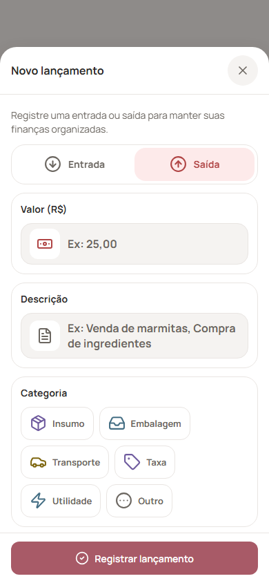
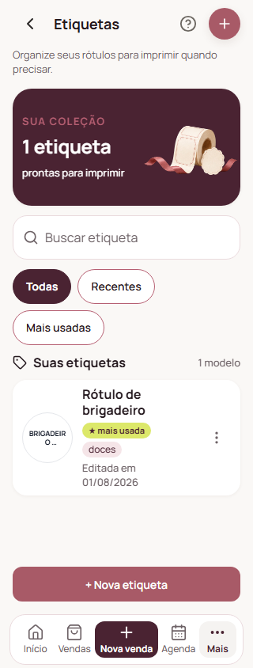

# Revisão de cortes no PWA/mobile — 10/09/2026

Foram corrigidos controles horizontais que deixavam opções parcialmente visíveis, textos limitados a uma linha e colunas estreitas que cortavam valores financeiros.

- Categorias de lançamento, filtros de compras/embalagens/receitas, seletores de produtos e abas administrativas quebram em linhas.
- Chips limitam sua largura ao espaço disponível e permitem rótulos longos.
- Cabeçalhos e seções de formulários permitem títulos completos. Abaixo de 400px, o subtítulo do cabeçalho ocupa uma linha de layout própria.
- Financeiro acomoda o seletor de período, empilha resumos em telas estreitas e reserva a largura do card para valores maiores.
- Fornecedores, etiquetas, link do catálogo e perguntas de ajuda exibem os textos completos.
- O carrossel do onboarding legado usa a largura disponível, sem mínimo maior que o espaço da tela.

## Verificação

- Exportação de produção do PWA concluída, com service worker gerado.
- Chromium: 320, 390, 500 e 1440px, altura de 844px.
- 287 capturas avaliadas: telas, rolagem até o fim, formulários e categorias de entrada/saída. Resultados em `results.json`.
- 31 rotas visitadas, incluindo onboarding, login/cadastro sem sessão e as 28 rotas internas listadas no resultado. Rotas legadas podem redirecionar para a tela canônica.
- Dados simulados incluem listas preenchidas, estados vazios e valores financeiros de seis dígitos. Nenhuma chamada externa acessa dados reais.
- 93 testes existentes passaram; TypeScript do mobile e UI e ESLint do mobile passaram.
- Miniaturas decorativas de etiquetas mantêm o resumo visual, com o nome completo ao lado e acesso à prévia. Esses textos de miniatura são excluídos da verificação de truncamento.

Os ajustes usam os componentes compartilhados com Android/iOS, mas a validação visual foi feita no PWA, sem emulador nativo. As telas restritas a outras marcas, como operações e varejo, foram revisadas no código; a marca Lucro Caseiro redireciona essas rotas. Recuperação de senha depende de uma sessão de recuperação válida. A revisão não simula todos os passos e combinações de dados de cada fluxo.

## Repetir a auditoria

Execute `apps/mobile/scripts/mobile-overflow-audit.cjs` com Playwright disponível. O servidor deve estar rodando com a exportação PWA mais recente.

Variáveis:

- `PLAYWRIGHT_PATH`: caminho do pacote Playwright, se não estiver no ambiente do projeto.
- `VALIDATION_PREVIEW_URL`: origem do preview local.
- `FORM_WIDTHS`: larguras separadas por vírgula.
- `FORM_EDITS=1`: inclui registros de etiquetas, compras, receitas e embalagens.
- `AUDIT_FORMS=1`: abre os formulários mapeados.
- `AUDIT_BOTTOM=1`: verifica também o fim da rolagem.
- `AUDIT_STRICT=1`: falha ao detectar cortes ou erros de execução.
- `AUDIT_PUBLIC=1`: testa sem sessão local.
- `AUDIT_ROUTES`: rotas separadas por vírgula.
- `AUDIT_OUTPUT`: pasta dos arquivos JSON e PNG, relativa ao diretório do script.

