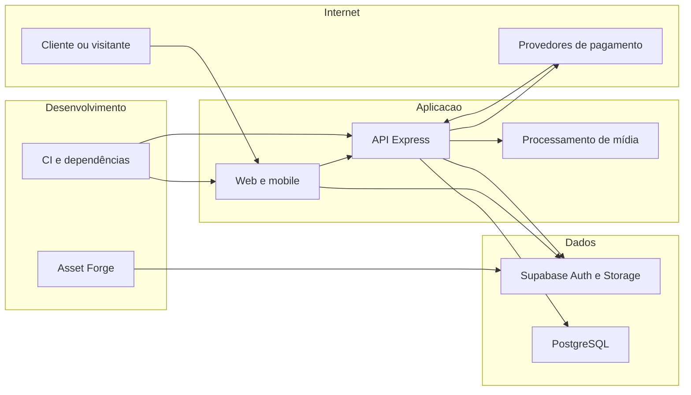

# Lucro Caseiro — modelo de ameaças baseado no repositório

## Executive summary

Os riscos dominantes são isolamento entre contas, integridade de pedidos/estoque e planos pagos, exposição por acesso direto ao banco e disponibilidade das rotas públicas. A auditoria de 10/09/2026 corrigiu caminhos concretos nessas áreas. Ferramentas de desenvolvimento e dependências também integram o escopo, mas seus riscos não equivalem automaticamente a exploração remota da aplicação. Este modelo descreve o código local após as correções; não certifica a configuração do ambiente hospedado.

## Scope and assumptions

Escopo: `apps/api`, `apps/web`, `apps/mobile`, `packages`, `tools/asset-forge`, manifests/lockfiles e configuração de build. Dados considerados: clientes, encomendas, receitas, preços, finanças, mídia, tokens de autenticação e estado de assinatura.

Hipóteses: aplicação multiusuário exposta à Internet; cada conta acessa seus próprios dados; catálogo e criação de pedidos são públicos por intenção; Auth e Storage são acessados por clientes, dados de negócio pela API. O ADR 0010 registra publicação na Railway em 04/08/2026, mas isso não confirma a configuração em setembro. A pergunta sobre uso atual em produção foi enviada ao usuário; sem confirmação até a redação, a classificação permanece condicional.

Não testados: infraestrutura hospedada, políticas efetivamente aplicadas no Supabase remoto, comprometimento de dispositivo/conta de operador, credenciais reais de pagamento, pentest de serviços de terceiros. Questões abertas: papel SQL efetivo no deploy, escala/limites esperados, uso simultâneo de Stripe e Google Play por uma conta e controles externos sobre ferramentas locais.

## System model

### Primary components

API Express e middlewares em `apps/api/src/main.ts`/`shared/middleware`; web Next.js com proxy/CSP em `apps/web/src/proxy.ts`; cliente Expo em `apps/mobile`; contratos Zod em `packages/contracts`; PostgreSQL/Drizzle em `packages/database`; Supabase Auth/Storage; Stripe/Google Play em `features/payments`/`subscription`; processamento de mídia em `features/marketing/video-editor.processor.ts`. pnpm/Turbo coordenam build e testes (`package.json`).

### Data flows and trust boundaries

- Internet → web/mobile/API: parâmetros, JSON, identificadores e arquivos via HTTP. Contratos validam formato; autenticação consulta Supabase; autorização precisa sempre derivar a conta do token validado. CORS restringe origens do navegador, não substitui autorização.
- Cliente → Supabase Auth/Storage: credenciais, sessões e mídia via HTTPS. Políticas de Storage permanecem separadas das tabelas de negócio. Evidências: clientes Supabase e migrações; não houve verificação remota.
- API → PostgreSQL: SQL parametrizado e transações pela conexão privilegiada. RLS e revogação de grants impedem acesso direto por papéis de clientes, mas não substituem filtros de conta na conexão da API. Evidências: `database-access.security.test.ts` e repositórios.
- Stripe/Google Play → API: eventos e comprovação de compras. Stripe verifica assinatura do corpo original e consulta estado atual; Google Play consulta provedor e confere titularidade. Evidências: `stripe.webhook.ts`, `stripe.usecases.ts`, `google-play.client.ts`, `subscription.usecases.ts`.
- API → provedores de IA/mídia: conteúdo autorizado da área de marketing; subprocessos locais processam arquivos. Área restrita e uso de `execFile` reduzem exposição, sem afirmar isolamento completo do parser de mídia.
- Desenvolvedor/CI → dependências/ferramentas: código de terceiros e entradas locais. Lockfile, patches verificados e testes integram a confiança do artefato. `tools/asset-forge` é uma ferramenta separada, com suas próprias credenciais e superfície HTTP.

#### Diagram

## Assets and security objectives

| Ativo                              | Por que importa                                  | Objetivo                        |
| ---------------------------------- | ------------------------------------------------ | ------------------------------- |
| Clientes, receitas e finanças      | Dados pessoais/comerciais privados por conta     | Confidencialidade e integridade |
| Pedidos, estoque e agendamentos    | Evitar reservas inválidas e prejuízo operacional | Integridade e disponibilidade   |
| Planos e comprovações de compra    | Evitar acesso pago indevido e perda de direitos  | Integridade                     |
| Tokens e credenciais de provedores | Impedem personificação e consumo não autorizado  | Confidencialidade               |
| API, clientes e parsers            | Sustentar operação diante de entradas hostis     | Disponibilidade                 |
| Artefatos e lockfiles              | Código executado deve corresponder ao revisado   | Integridade                     |

## Attacker model

### Capabilities

Visitante pode enviar pedidos públicos, manipular headers e repetir requisições. Usuário autenticado pode fabricar IDs/payloads de outra conta. Atacante pode entregar entradas malformadas onde o produto aceita arquivos/texto. Na ferramenta de desenvolvimento, adversário na mesma rede só tem acesso se o operador expuser o listener.

### Non-capabilities

Não se pressupõe chave de serviço, assinatura Stripe válida fabricada, controle do banco ou permissão de publicar código. Comprometer uma conta privilegiada de marketing é pré-condição adicional; não equivale a acesso público ao processamento de vídeo.

## Entry points and attack surfaces

| Superfície               | Acesso/fronteira                          | Controle e evidência                                                       |
| ------------------------ | ----------------------------------------- | -------------------------------------------------------------------------- |
| CRUD privado             | Cliente autenticado → API                 | `shared/middleware/auth.ts`; filtros de conta em repositórios              |
| Pedidos/catálogos        | Visitante → API                           | `features/retail`, `features/catalog`; contratos e quotas                  |
| Tabelas via Supabase     | Cliente → dados                           | Migração `20260910123323_restrict_api_table_access.sql`                    |
| Billing                  | Provedor/cliente → API                    | `features/payments`, `features/subscription`                               |
| Mídia/IA                 | Marketing autorizado → parsers/provedores | `features/marketing/video-editor.processor.ts`                             |
| Mensagens de erro        | Resposta/biblioteca → UI                  | `packages/contracts/src/user-errors.ts`                                    |
| Build e ferramenta local | Desenvolvedor/rede → processo             | `apps/api/Dockerfile`, `tools/asset-forge/worker.mjs`, `patches/README.md` |

## Top abuse paths

1. Usuário obtém/adivinha ID alheio → associa cliente/material ao próprio registro → join revela dados. Corrigido por validação de propriedade e joins restritos.
2. Visitante alterna Authorization falso → cada requisição cria quota diferente → abuso da operação pública. Corrigido usando IP/identidade validada.
3. Visitante combina linhas repetidas ou pedidos concorrentes → excede estoque reservado → vendedor recebe pedidos impossíveis. Corrigido com soma e transação/locks.
4. Cliente chama tabela diretamente com papel público → contorna autorização da API → expõe/altera dados. Migração bloqueia grants; exposição remota depende do estado anterior do ambiente.
5. Webhook antigo chega depois de cancelamento/renovação → snapshot sobrescreve plano atual. Reconsulta ao provedor corrige entrega sequencial fora de ordem da mesma assinatura; concorrência e múltiplas origens ainda são limites.
6. Entrada malformada chega a parser/regex → processamento cresce excessivamente → build ou UI trava. Patches e limite antes das regex reduzem os caminhos reproduzidos.
7. Operador expõe ferramenta local com credenciais de geração → vizinho de rede aciona trabalho pago. Listener/autenticação da ferramenta devem impor a fronteira local.

## Threat model table

Prioridades abaixo indicam o risco do caminho caso o controle seja ausente, e não uma declaração de vulnerabilidade residual confirmada.

| Threat ID | Threat source            | Prerequisites                    | Threat action                            | Impact                             | Impacted assets | Existing controls (evidence)                   | Gaps                                            | Recommended mitigations                                      | Detection ideas                                 | Likelihood                          | Impact severity               | Priority |
| --------- | ------------------------ | -------------------------------- | ---------------------------------------- | ---------------------------------- | --------------- | ---------------------------------------------- | ----------------------------------------------- | ------------------------------------------------------------ | ----------------------------------------------- | ----------------------------------- | ----------------------------- | -------- |
| TM-001    | Conta hostil             | Token válido e ID alheio         | Relacionar registros entre contas        | Vazamento/alteração                | Dados privados  | Ownership e joins (`recipes`, `orders`)        | API privilegiada depende de filtros             | Manter testes com duas contas                                | Contar rejeições de ownership sem IDs sensíveis | Alta antes da correção              | Alta: dados de outra conta    | high     |
| TM-002    | Visitante                | Rota pública                     | Esgotar quota/estoque                    | Interrupção e prejuízo             | Pedidos/API     | Rate limiter e reserva transacional (`retail`) | IPs distribuídos; contenção real não ensaiada   | Monitorar quotas e reservas; validar concorrência no staging | 429, conflitos e tempo de locks                 | Alta sem controles                  | Média: custo/disponibilidade  | high     |
| TM-003    | Cliente público          | Grants indevidos no ambiente     | Acessar tabela fora da API               | Exposição ampla                    | Banco e planos  | RLS/grants e testes SQL                        | Configuração hospedada não inspecionada         | Aplicar migração pelo deploy e verificar papéis              | Falhas de permissão e drift de grants           | Condicional aos grants              | Alta: fronteira de contas     | high     |
| TM-004    | Eventos/retries          | Eventos válidos fora de ordem    | Sobrescrever plano                       | Acesso indevido/perda de direito   | Assinaturas     | Assinatura e estado atual (`payments`)         | Concorrência e múltiplas assinaturas/provedores | Persistir titularidade/versão se esses fluxos coexistirem    | Divergência plano/provedor; reconciliação       | Média: retries são normais          | Média: plano individual       | medium   |
| TM-005    | Entrada hostil           | Conteúdo chega ao parser         | Consumir CPU/memória                     | Travamento                         | Build/UI        | Patches e limite em `user-errors.ts`           | Parsers têm outras superfícies                  | Preservar regressões; atualizar upstream                     | Timeout/erro de parser sem payload              | Média, depende do fluxo             | Média: disponibilidade        | medium   |
| TM-006    | Rede local               | Ferramenta exposta e credenciais | Disparar geração/escrever artefato       | Custos e integridade               | Asset Forge     | Restrições do worker revisadas nesta auditoria | Firewall/host do operador não inspecionados     | Usar loopback por padrão e token em acesso remoto            | Contagem de rejeições e geração                 | Baixa no loopback; maior se exposto | Média: credenciais de serviço | medium   |
| TM-007    | Dependência comprometida | Código entra no build            | Executar no contexto do desenvolvedor/CI | Roubo de segredo/artefato alterado | Supply chain    | Lockfile, audit e gate dos patches             | Audit não detecta todo pacote malicioso         | Revisar mudanças de origem e manter CI restrito              | Diferenças de lock/hash e egress inesperado     | Baixa, não demonstrada              | Alta: credenciais/artefatos   | medium   |

## Criticality calibration

- **critical**: execução remota na API com credenciais de serviço; extração irrestrita de todas as contas. Não confirmado como exploração nesta revisão.
- **high**: leitura/alteração entre contas; acesso direto indevido a tabelas; abuso público amplo sem custo relevante ao atacante.
- **medium**: plano individual incorreto; travamento reproduzível de UI/build; ferramenta local exposta a uma rede com pré-condições.
- **low**: metadado não sensível exposto; oportunidade de hardening sem caminho de impacto comprovado.

## Focus paths for security review

| Caminho                                                     | Motivo                                             | Ameaças        |
| ----------------------------------------------------------- | -------------------------------------------------- | -------------- |
| `apps/api/src/shared/middleware`                            | Ordem de autenticação, quotas e confiança em proxy | TM-001, TM-002 |
| `apps/api/src/features/retail/retail.repo.pg.ts`            | Locks, reservas, rollback e filtros                | TM-001, TM-002 |
| `apps/api/src/features/payments/stripe.usecases.ts`         | Reconciliação de planos e ordem de eventos         | TM-004         |
| `apps/api/src/features/subscription`                        | Titularidade/replay Google Play                    | TM-004         |
| `packages/database/src/schema` e `src/migrations`           | RLS, grants e drift do ambiente                    | TM-003         |
| `apps/api/src/features/marketing/video-editor.processor.ts` | Arquivos e subprocessos                            | TM-005         |
| `packages/contracts/src/user-errors.ts`                     | Limites antes de parsers/regex                     | TM-005         |
| `tools/asset-forge/worker.mjs`                              | Exposição HTTP e credenciais locais                | TM-006         |
| `scripts/security-audit.mjs` e `patches`                    | Integridade da exceção de dependência              | TM-007         |

## Quality check

Entradas e fronteiras descobertas estão representadas; runtime está separado de CI/dev; hipóteses de ambiente e perguntas pendentes estão explícitas. As conclusões operacionais dependem do deploy e de validação da configuração real. Resultados concretos, testes e limitações dos scanners constam em `auditoria-seguranca-2026-09-10.md`.
